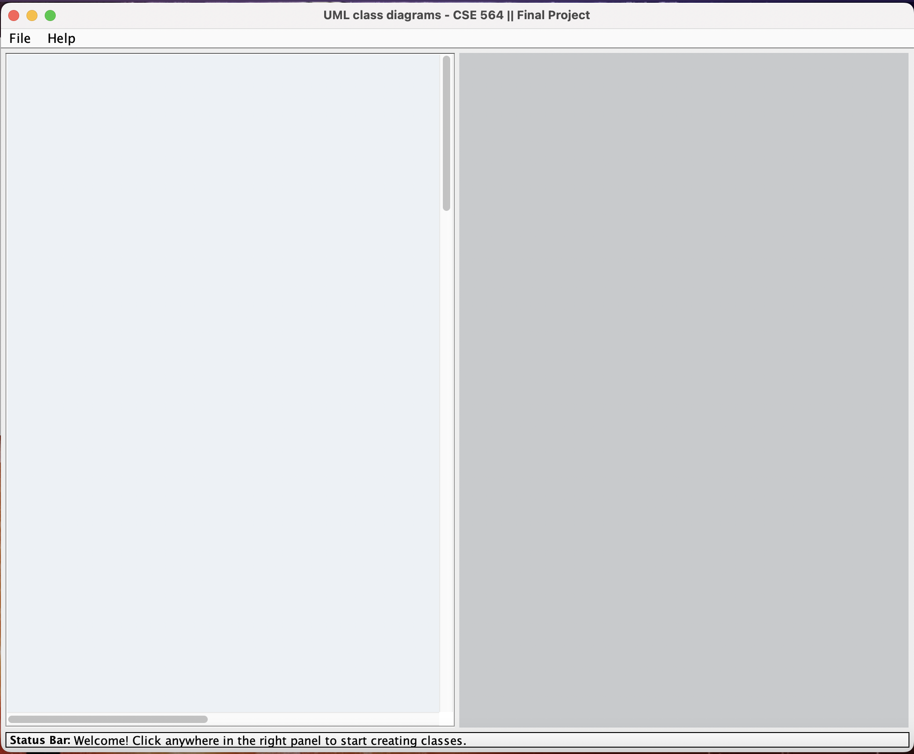
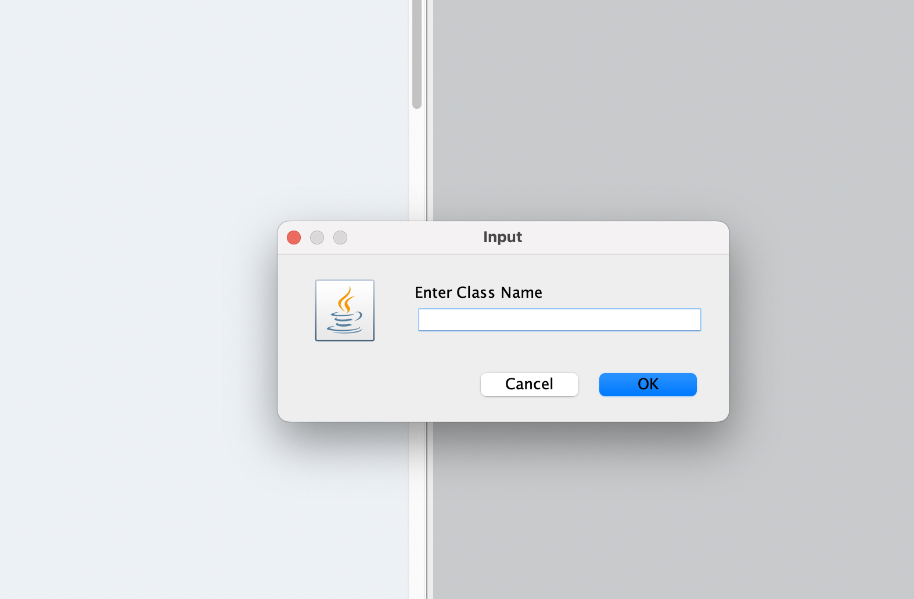
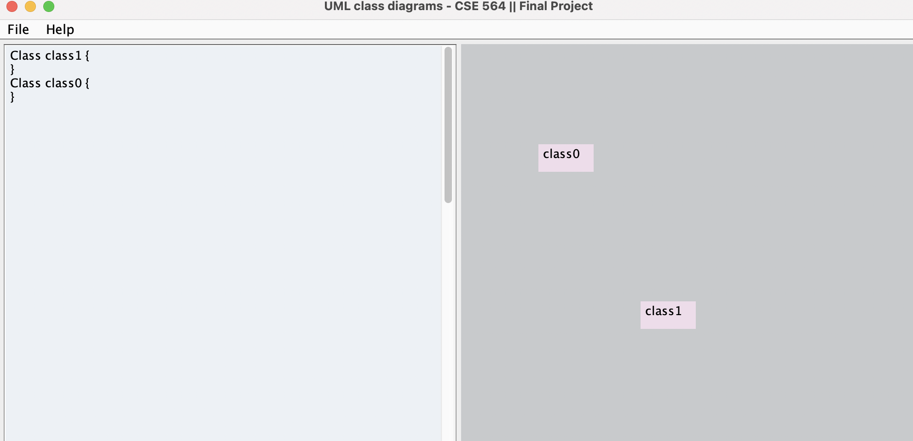
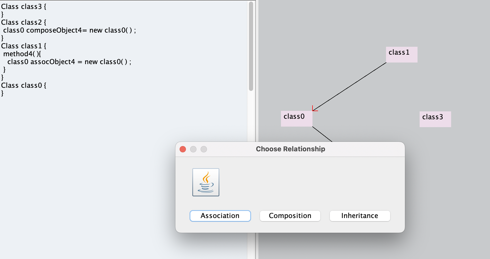
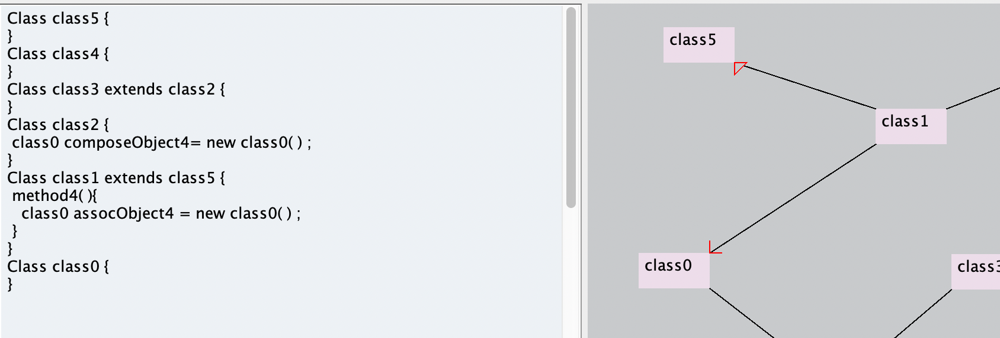

# Application-for-creating-UML-and-writing-pseudocode-on-inputs-from-User
The GUI based application has three panels to present user with the UML, Code and status. The user clicks on UML panel and types class name into pop-up box. The box for Class is drawn on the panel, and the appropriate pseudocode appears immediately in the code panel. The current status will be displayed in the status panel. When a user clicks on two boxes, a pop-up window will appear and prompt them to select a relationship. The selected relation will be depicted on a UML panel, and the appropriate class code will be modified to reflect the relation.

Additional functionalities of the application include the ability to create a NEW UML and clean the panels. It offers a SAVE and LOAD functionality that allows you to save your code and UML for loading it again to continue working.

## Architectural Patterns:
### 1) Model View Controller
The model view controller pattern was used to separate the application into the 3 logical components:
####    Model: 
The main logic of the code is mentioned in the model. It contains the SingletonDataSrc and the strategies(Knowledge Source) for deciding what to add to the resource (SingletonDataSrc).
####    View: 
The view corresponds to the logic of the GUI of the application. The DrawPanel that the user will interact with is part of the view along with the menu, CodePanel, and status bar.
####    Controller: 
The controller acts as an interface between the model and the view. Actions performed by the user in the view such as mouse clicks trigger the events in the controller. There are two classes within the controller - the MenuController and the Controller. The MenuController deals with the action events triggered by the menu bar. The Controller class is triggered by the mouse events and calls the Strategy pattern to handle the operation - making boxes or lines
### 2) Blackboard
The blackboard pattern was used to create a SingletonDataSrc that acts as a shared space for storing the information.

## Design Patterns:
### 1) Observer
#### SingletonDataSrc (Observable) , DrawPanel (Observers), CodePanel (Observers), StatusPanel (Observers)
The SingletonDataSrc is the subject (Observable) with the DrawPanel, CodePanel, and StatusPanel as Observers. Whenever the user clicks on the DrawPanel, the SingletonDataSrc will update its common resource (via strategy pattern) creating a class or adding a line. Every time it sets the classname or updates it, or adds a relation between two classes, it notifies the observers. The  DrawPanel calls its paintcomponent method to handle the task, the CodePanel writes the data on the screen, and the StatusPanel logs the event. 

### 2) Singleton
#### SingletonDataSrc
The singleton pattern was used to implement the class SingletonDataSrc. The class holds all the information like the coordinates of the boxes, lines, decorations, the names of the classes, and the relationship between the two classes. It also has the logic for computing whether the mouse click occurred in the vicinity of the box or not to determine whether a box is to be created or not. 
### 3) Strategy
#### Strategy, StrategyLine, StrategyBox
The strategy pattern was used to add two different implementations for when a user clicks in the DrawPanel. Upon a mouse click, the controller decides whether to call StrategyLine or StrategyBox. StrategyBox computes the coordinates of the box and then adds the box to SingletonDataSrc which notifies DrawPanel to draw the box. StrategyLine computes the coordinates for the line and asks the user to select between the 3 types of relations and initializes the chain of responsibility. The chain of responsibility will decide what to decorate and will call respective decorations and then will add the data to SingletonDataSrc, which will notify the DrawPanel, StatusPanel, and CodePanel to repaint themselves.

### 4) Chain of Responsibility
#### ChainHandler, ChainHandlerArrow, ChainHandlerDiamond, ChainHandlerTriangle
The chain of responsibility pattern was implemented where we have 3 handlers, one for each relation. The handlers are linked to form a chain. From the StrategyLine, the choice of the user is passed on to each handler, where the respective handler decides what decorations we need to add over the line. 
### 5) Decorator
#### Line, LineConcrete, LineDecorator, LineDecoArrow,  LineDecoDiamond, LineDecoTriangle
The decorator pattern was used to add the relation decorations to the base line. The decision from the chain handler was passed to the respective decorator class.

## Class Diagram

## Output

